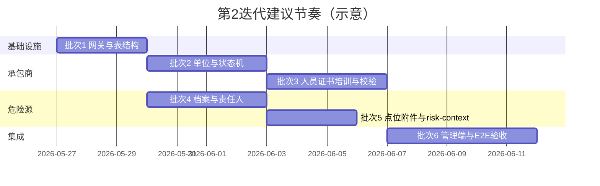

# 第 2 迭代：承包商准入与重大危险源开发方案评审稿

## 1. 文档信息

| 项目 | 内容 |
| --- | --- |
| 文档类型 | 研发落地 / 评审稿 |
| 所属阶段 | 一期第 2 迭代（准入与风险对象） |
| 依据文档 | `design/09_一期总体PRD.md`、`design/10_一期落地设计/00_开发总览/一期开发总览.md`、`03_承包商准入/落地设计.md`、`04_重大危险源/落地设计.md` |
| 代码基线 | 第 1 迭代端到端联调验收已通过（`67703ce` 及之后） |
| 目标读者 | 产品 / HSE、架构、研发、测试、实施 |

---

## 2. 背景与目标

### 2.1 背景

第 1 迭代已完成**平台底座**闭环：登录与网关鉴权、IAM 菜单与权限、主数据四类台账、系统配置与规则引擎基础能力、管理端动态导航与端到端联调验收。

第 2 迭代是一期路线中的**业务对象奠基阶段**：在可引用的区域、装置、设备、监测点位之上，交付**承包商准入体系**与**重大危险源一源一档**，为第 3 迭代报警闭环、第 4 迭代作业票规则校验提供稳定对象与查询接口。

### 2.2 迭代目标（对齐一期总览）

| 维度 | 目标 |
| --- | --- |
| 业务 | 承包商单位/人员可完成准入审核；证书、培训、黑名单状态可被规则查询；重大危险源可绑定区域、责任人、点位和附件 |
| 技术 | 两个业务服务从骨架落地为可 CRUD、可状态流转、可审计、可被网关与管理端访问的最小闭环 |
| 集成 | 与主数据、配置规则、文件中心、审计服务形成明确依赖与接口契约；为作业票/报警预留**资格校验**与**风险上下文**接口 |
| 验收 | 管理端可完成试点场景全流程操作；核心单测与端到端联调用例通过 |

### 2.3 本迭代明确不做

- 报警接入、分级、派发、关闭（第 3 迭代）。
- 作业票创建、审批、许可状态机（第 4 迭代）。
- 移动端现场动作（第 5 迭代）。
- 报表大屏与上线切换清单（第 6 迭代）。
- 承包商/危险源的批量 Excel 导入、复杂工作流引擎、与 HR/门禁/定位系统的生产级对接（可留接口与占位，不阻塞最小闭环）。

---

## 3. 第 1 迭代基线（已完成，供第 2 迭代依赖）

### 3.1 已交付能力摘要

| 能力域 | 现状 | 第 2 迭代用法 |
| --- | --- | --- |
| 网关 `psm-gateway` | `/api/iam/**`、`/api/config/**`、`/api/master-data/**` 已转发并鉴权 | 扩展 `/api/contractors/**`、`/api/major-hazards/**` |
| 鉴权 `psm-auth-service` | 登录、`auth_user`、token | 不变；业务操作人取自网关透传头 |
| IAM `psm-iam-service` | 组织/用户/角色/菜单、`users/me/permissions`、菜单种子 | 新增承包商、危险源菜单与权限点 |
| 主数据 `psm-master-data-service` | `base_area/unit/equipment`、`monitor_point` 独立表与 CRUD | 危险源绑定区域/装置/设备/点位；区域 `major_hazard_flag` 已预留 |
| 配置规则 `psm-config-rule-service` | 字典/表单/流程/规则/通知/附件策略、规则评估 API | 证书类型、准入规则、到期策略等字典与规则项 |
| 审计 `psm-audit-service` | 审计查询能力（主数据写入审计已打通） | 承包商/危险源关键状态变更归口查询 |
| 管理端 `admin-web` | 登录、动态菜单、主数据/IAM/配置/审计页 | 新增承包商、危险源台账与详情页 |
| 前端 SDK | `domain-types`、`api-client` | 扩展类型与 API 封装 |

### 3.2 第 1 迭代遗留（不阻塞第 2 迭代启动，需并行消化）

| 遗留项 | 建议处理时机 |
| --- | --- |
| 角色权限分配 UI 仅支持用户绑角色，缺角色绑菜单/API 的可视化 | 第 2 迭代 IAM 菜单扩展时一并补「角色授权」最小页，或维持种子数据 + 后台 API |
| 复杂规则 DSL | 第 2 迭代仅用「结构化规则项 + evaluate」表达准入拦截原因 |
| `tenantId` 部分接口仍由前端传入 | 新接口统一优先 `UserContextHeaders`，并校验与登录租户一致 |

---

## 4. 第 2 迭代范围边界

### 4.1 必须交付（MoSCoW：Must）

#### 4.1.1 承包商准入（`psm-contractor-service`，端口 `18085`）

| 子域 | 一期最小范围 |
| --- | --- |
| 单位管理 | CRUD、状态机（待提交→待审核→已准入→待复审/已停权/黑名单/已退回）、准入审核 API |
| 单位资质 | 资质记录 CRUD、有效期、核心资质标识（用于过期拦截） |
| 人员管理 | CRUD、人员状态机、与单位关联 |
| 人员证书 | 证书 CRUD、类型、有效期、附件引用 |
| 人员培训 | 培训记录 CRUD、结果、有效期 |
| 违章 | 违章记录登记（一期可不做复杂扣分引擎，仅记录并支持人工停权触发） |
| 黑名单 | 单位/人员黑名单标记与原因、审计 |
| **对外校验** | `POST /api/contractors/workers/eligibility-check`（作业票选人前置，第 4 迭代调用） |

#### 4.1.2 重大危险源（`psm-major-hazard-service`，端口 `18086`）

| 子域 | 一期最小范围 |
| --- | --- |
| 档案 | CRUD、编码、名称、等级、介质、容量、关联区域/装置 |
| 包保责任 | 三类责任人（主要/技术/操作）维护 |
| 点位绑定 | 与 `monitor_point` 多对多关联（仅存 ID + 冗余展示字段） |
| 附件 | 元数据 + `file_id` 引用文件中心，分类（评估报告、备案、SDS 等） |
| 状态 | 正常/停用/检修/异常及状态变更日志 |
| **对外查询** | `POST /api/major-hazards/risk-context`（按区域/装置/点位返回危险源摘要，供报警/作业票第 3、4 迭代调用） |

### 4.2 建议交付（Should）

- 证书/资质**到期预警**列表（管理端筛选「30 天内到期」）。
- 危险源详情页**关联视图占位**：报警列表、作业票列表（第 3、4 迭代接真实数据，本期返回空列表或 Mock 开关）。
- 管理端**准入审核工作台**（待审单位/人员队列）。

### 4.3 本迭代不做（Won't）

- 违章自动扣分触发停权的规则引擎全自动（仅记录 + 人工操作）。
- 危险源点位**实时趋势图**（依赖报警/时序数据，第 3 迭代后增强）。
- 承包商与门禁/定位标签同步。
- 全量历史数据迁移工具（仅提供 SQL 模板与字段映射说明）。

---

## 5. 当前代码现状

| 模块 | 路径 | 现状 |
| --- | --- | --- |
| 承包商服务 | `code/backend/services/psm-contractor-service` | 仅 `ContractorServiceApplication` + `application.yml`（`18085`），无 Controller/Mapper/表结构 |
| 危险源服务 | `code/backend/services/psm-major-hazard-service` | 仅 `MajorHazardServiceApplication` + `application.yml`（`18086`），无业务实现 |
| 网关 | `psm-gateway` | **未**配置 contractor / major-hazard 转发 |
| 管理端 | `admin-web` `nav.ts` | `AppView` 未包含承包商、危险源视图 |
| IAM 菜单种子 | `psm-iam-service` `data.sql` | 无承包商/危险源菜单项 |
| 主数据 | `base_area` 等 | 已拆实体表，可供 FK 或逻辑引用（`area_id`、`equipment_id`、`monitor_point_id`） |

**结论**：第 2 迭代属于**从零到最小闭环**的实现，可充分复用第 1 迭代 established 的分层模式（Controller → Service → Mapper、`ResponseVO`、`BusinessException`、审计写入、admin-web `panels` 模式）。

---

## 6. 总体技术路线

### 6.1 架构原则（延续第 1 迭代）

1. **业务表落在各自服务库**，不重复创建 `base_area`、`monitor_point` 等主数据物理表。
2. **附件存元数据 + file_id**，二进制走 `psm-file-service`（`18092`），策略走 config 附件策略项。
3. **关键状态变更写审计**（准入、停权、黑名单、危险源发布/停用、责任人变更、点位绑定变更）。
4. **对外校验接口返回可解释阻断原因**（`code` + `message` + `details[]`），供 Web/移动端/作业票复用。
5. **租户隔离**：所有业务表含 `tenant_id`；接口从网关上下文解析租户，避免仅信任前端参数。

### 6.2 服务端口与网关规划

| 服务 | 端口 | 网关路径（建议） |
| --- | --- | --- |
| `psm-contractor-service` | 18085 | `/api/contractors/**` |
| `psm-major-hazard-service` | 18086 | `/api/major-hazards/**` |

网关 `GatewayProperties` 增加：

- `contractor-service-url` → `PSM_CONTRACTOR_SERVICE_URL`
- `major-hazard-service-url` → `PSM_MAJOR_HAZARD_SERVICE_URL`

`GatewayProxyController` 增加对应 `@RequestMapping`，与 IAM/Config 相同：**authenticate + 透传 UserContext**。

### 6.3 跨服务调用策略

| 场景 | 策略 |
| --- | --- |
| 校验区域/点位是否存在 | 第 2 迭代优先**逻辑校验**（调用 master-data 内部 HTTP 或 Feign）；若工期紧，可在绑定写入时校验 ID 非空 + 管理端下拉仅选有效数据，服务启动不做强依赖 |
| 字典（证书类型、危险源等级） | 读 `psm-config-rule-service` 字典项；管理端下拉与后端校验共用 `dictCode` |
| 规则评估（准入拦截） | 承包商服务内**领域规则**实现为主；可选调用 config `rules/evaluate` 做扩展，避免第 2 迭代耦合过重 |
| 审计查询 | 写入各服务 `audit_change_log` 或统一事件；**查询**归口 `psm-audit-service`（与第 1 迭代结论一致） |

### 6.4 数据模型原则

- 承包商、危险源均使用**独立业务表**（见落地设计 03/04），不使用 `master_data_item` 承载。
- 状态字段使用**枚举字符串**（与 PRD 状态机一致），状态迁移通过 Service 集中校验，禁止 Controller 直改状态。
- 软删除：主档 `deleted` 或 `status=DELETED` 二选一，**全模块统一**（建议 `deleted` + `status` 分离：status 表示业务生命周期，deleted 表示物理归档）。

---

## 7. 承包商模块详细方案

### 7.1 状态机（与 PRD / 落地设计对齐）

**单位**

```text
DRAFT(待提交) -> PENDING_REVIEW(待审核) -> APPROVED(已准入)
PENDING_REVIEW -> REJECTED(已退回) -> DRAFT
APPROVED -> PENDING_REVIEW(待复审) -> APPROVED
APPROVED -> SUSPENDED(已停权)
APPROVED | SUSPENDED -> BLACKLIST(黑名单)
```

**人员**

```text
INCOMPLETE(待完善) -> PENDING_REVIEW -> APPROVED(已准入)
APPROVED -> SUSPENDED -> BLACKLIST
证书过期/培训失效 -> RESTRICTED(受限准入)  # 仍可见但 eligibility-check 不通过
```

### 7.2 核心 API（管理端 + 未来作业票）

| 接口 | 方法 | 说明 |
| --- | --- | --- |
| `/api/contractors/companies` | GET/POST | 单位分页、新增 |
| `/api/contractors/companies/{id}` | GET/PUT | 详情、修改 |
| `/api/contractors/companies/{id}/submit` | POST | 提交审核 |
| `/api/contractors/companies/{id}/approve` | POST | 审核通过/退回 |
| `/api/contractors/companies/{id}/suspend` | POST | 停权 |
| `/api/contractors/companies/{id}/blacklist` | POST | 加入黑名单 |
| `/api/contractors/companies/{id}/qualifications` | GET/POST | 单位资质 |
| `/api/contractors/workers` | GET/POST | 人员分页、新增 |
| `/api/contractors/workers/{id}` | GET/PUT | 人员详情 |
| `/api/contractors/workers/{id}/certificates` | GET/POST | 证书 |
| `/api/contractors/workers/{id}/trainings` | GET/POST | 培训 |
| `/api/contractors/workers/{id}/violations` | GET/POST | 违章 |
| `/api/contractors/workers/eligibility-check` | POST | **资格校验**（单位 ID、人员 ID 列表、作业类型可选） |

**eligibility-check 请求示例（逻辑字段）**

```json
{
  "tenantId": 1,
  "companyId": 100,
  "workerIds": [1001, 1002],
  "workType": "HOT_WORK",
  "checkPoint": "ADD_WORKER"
}
```

**响应（与 config 规则评估风格一致）**

```json
{
  "passed": false,
  "reasons": [
    { "code": "WORKER_CERT_EXPIRED", "message": "人员张三特种作业证已过期", "workerId": 1001 }
  ]
}
```

### 7.3 数据表（首期建表）

| 表名 | 说明 |
| --- | --- |
| `contractor_company` | 单位主档 |
| `contractor_qualification` | 单位资质 |
| `contractor_worker` | 人员 |
| `worker_certificate` | 人员证书 |
| `worker_training_record` | 培训记录 |
| `contractor_violation` | 违章 |
| `contractor_blacklist` | 黑名单记录（单位/人员维度） |
| `contractor_audit_record` | 准入审核流水 |

脚本位置：`psm-contractor-service/src/main/resources/db/schema.sql`、`data.sql`（试点种子 1～2 家单位）。

### 7.4 管理端页面

| 页面 | view 标识（建议） | 能力 |
| --- | --- | --- |
| 承包商单位列表 | `contractor:companies` | 查询、状态筛选、新增、提交、审核入口 |
| 单位详情 | 抽屉/子路由 | 基本信息、资质列表、人员 Tab |
| 承包商人员列表 | `contractor:workers` | 证书/培训状态列、准入状态 |
| 人员详情 | 抽屉 | 证书、培训、违章、资格校验试算（调试） |
| 待审队列（Should） | `contractor:reviews` | 待审单位/人员 |

### 7.5 权限点（IAM 菜单种子扩展）

| resource_code | 名称 | route_path |
| --- | --- | --- |
| `MENU_ROOT_CONTRACTOR` | 承包商管理 | — |
| `MENU_CTR_COMPANIES` | 承包商单位 | `contractor:companies` |
| `MENU_CTR_WORKERS` | 承包商人员 | `contractor:workers` |
| `MENU_ROOT_HAZARD` | 重大危险源 | — |
| `MENU_HAZ_LEDGER` | 危险源台账 | `hazard:ledger` |
| `MENU_HAZ_REVIEWS` | 危险源审核（可选） | `hazard:reviews` |

---

## 8. 重大危险源模块详细方案

### 8.1 业务流程（一期简化）

```text
DRAFT -> 维护分级/介质/区域绑定 -> 配置责任人 -> 绑定点位 -> 上传附件 -> PUBLISHED(已发布)
PUBLISHED -> SUSPENDED(停用) / MAINTENANCE(检修) / ABNORMAL(异常)
状态变更写 major_hazard_status_log
```

一期**可不实现**复杂「审核委员会」流，用「保存草稿 + 发布」两步代替全量审批流；若产品坚持审核，复用 config `workflows` 仅作配置占位，第 2 迭代用 Service 硬编码「发布」权限点。

### 8.2 核心 API

| 接口 | 方法 | 说明 |
| --- | --- | --- |
| `/api/major-hazards` | GET/POST | 台账分页、新增 |
| `/api/major-hazards/{id}` | GET/PUT | 详情、修改 |
| `/api/major-hazards/{id}/publish` | POST | 发布 |
| `/api/major-hazards/{id}/status` | POST | 停用/检修/异常 |
| `/api/major-hazards/{id}/responsibilities` | GET/PUT | 包保责任人 |
| `/api/major-hazards/{id}/points` | GET/POST/DELETE | 点位绑定 |
| `/api/major-hazards/{id}/attachments` | GET/POST/DELETE | 附件元数据 |
| `/api/major-hazards/{id}/alarms` | GET | 关联报警（第 3 迭代实现，本期空列表） |
| `/api/major-hazards/{id}/permits` | GET | 关联作业票（第 4 迭代实现，本期空列表） |
| `/api/major-hazards/risk-context` | POST | 风险上下文（区域/装置/点位 → 危险源列表 + 最高等级 + 是否含未关闭高等级报警占位） |

**risk-context 响应要点（供作业票规则预留）**

```json
{
  "areaId": 10,
  "hazards": [{ "id": 1, "name": "罐区A", "level": "LEVEL_1", "status": "NORMAL" }],
  "maxLevel": "LEVEL_1",
  "blockingAlarm": false,
  "blockingReason": null
}
```

`blockingAlarm` 在第 3 迭代前恒为 `false` 或读 config 模拟开关；接口契约先行稳定。

### 8.3 数据表

| 表名 | 说明 |
| --- | --- |
| `major_hazard` | 主档 |
| `major_hazard_responsibility` | 包保责任 |
| `major_hazard_point_rel` | 点位关联 |
| `major_hazard_attachment` | 附件元数据 |
| `major_hazard_status_log` | 状态变更 |

### 8.4 管理端页面

| 页面 | view | 能力 |
| --- | --- | --- |
| 危险源台账 | `hazard:ledger` | 分级筛选、新增、发布、状态变更 |
| 危险源详情 | 抽屉/Tab | 档案、责任人、点位多选、附件列表、关联报警/作业占位 |

绑定点位 UI：调用主数据 `monitor-points` 分页/下拉，仅允许选**启用**点位。

---

## 9. 横切能力改造清单

| 序号 | 改造项 | 负责模块 | 说明 |
| --- | --- | --- | --- |
| H1 | 网关路由 | gateway | `/api/contractors/**`、`/api/major-hazards/**` |
| H2 | IAM 菜单与角色种子 | iam | `data.sql` 增加菜单；`PLATFORM_ADMIN` 授权 |
| H3 | 前端类型与 API | domain-types、api-client | 承包商/危险源 DTO、分页、状态操作 |
| H4 | admin-web 视图 | admin-web | `nav.ts`、`panels.tsx` 扩展；复用 `ui-helpers` 表格/表单模式 |
| H5 | 字典种子 | config-rule | `CERT_TYPE`、`HAZARD_LEVEL`、`QUALIFICATION_TYPE` 等 |
| H6 | 文件上传 | file-service + admin-web | 资质/附件上传走统一 file API（若 file 未就绪，本期 Base64 仅限开发环境） |
| H7 | 审计 | contractor、hazard、audit | 关键操作写变更日志；审计页增加 objectType 筛选 |
| H8 | 单测 | 各服务 | Service 状态机、eligibility-check、risk-context 单测 |

---

## 10. 落地步骤（建议 6 批，约 3～4 周，可并行前后端）

### 10.1 批次总览



> 批次 2～3 与 4～5 可由不同研发并行，批次 6 统一联调。

---

### 批次 1：基础设施（第 1～3 工作日）

**交付**

- `psm-contractor-service`、`psm-major-hazard-service` 的 `schema.sql`（空表 + 索引 + tenant_id）。
- 网关配置与转发；本地 `application.yml` 数据源（与 iam 同模式 H2/MySQL 按环境）。
- IAM 菜单种子、`admin-web` 空页面占位（菜单可点、显示「开发中」亦可）。
- `domain-types` / `api-client` 骨架类型。

**完成标准**

- `mvn -pl services/psm-contractor-service,services/psm-major-hazard-service,services/psm-gateway -am test` 通过。
- `curl` 经网关 `18080` 访问新路径返回 401/404 而非连接拒绝（路由通）。

---

### 批次 2：承包商单位与准入状态机（第 4～7 工作日）

**交付**

- 单位 CRUD、提交、审核、停权、黑名单 API 与 Service 状态校验。
- `contractor_qualification` CRUD；核心资质过期标记（定时或查询时计算）。
- 审计：审核、停权、黑名单。
- 管理端「承包商单位」列表 + 详情 + 审核操作。

**完成标准**

- 单测覆盖非法状态迁移（如 DRAFT 直接 APPROVED 应失败）。
- 管理端可完成：新增单位 → 提交 → 审核通过 → 停权。

---

### 批次 3：承包商人员、证书、培训与资格校验（第 8～11 工作日）

**交付**

- 人员 CRUD 及状态；证书、培训子资源 API。
- `eligibility-check`：单位未准入、人员未准入、黑名单、证书过期、培训失效等规则。
- 违章记录登记（最小）。
- 管理端人员列表/详情；单位详情下人员 Tab。
- config 字典：证书类型、作业类型（与校验关联）。

**完成标准**

- `eligibility-check` 单测 ≥ 8 条场景（通过/各类失败）。
- Postman/集成测试：已准入且证书有效 → `passed=true`；过期证书 → `passed=false` 且 reasons 可读。

---

### 批次 4：重大危险源档案与责任人（第 4～7 工作日，可与批次 2 并行）

**交付**

- `major_hazard` CRUD、发布、状态变更及 `status_log`。
- `major_hazard_responsibility` 维护（三类责任人）。
- 绑定 `area_id`、`unit_id`（校验主数据 ID 存在性可选）。
- 管理端危险源台账 + 详情（档案 + 责任人 Tab）。

**完成标准**

- 未绑定区域/责任人时不允许 `publish`。
- 管理端可完成：新建 → 填责任人 → 发布。

---

### 批次 5：危险源点位、附件与 risk-context（第 8～10 工作日）

**交付**

- `major_hazard_point_rel` 绑定/解绑；`major_hazard_attachment` + 文件中心联调。
- `risk-context` API（按 areaId/unitId/pointIds 查询危险源摘要）。
- 管理端点位多选、附件上传列表。

**完成标准**

- 同一监测点位可绑定多个危险源（多对多）；解绑写审计。
- `risk-context` 单测：给定 areaId 返回正确危险源列表与 maxLevel。

---

### 批次 6：集成、文档与端到端验收（第 11～15 工作日）

**交付**

- 全服务本地启动脚本/README 更新（gateway、auth、iam、master-data、config、audit、contractor、hazard、file 按需）。
- IAM 菜单与权限联调；admin-web 动态菜单可见承包商/危险源。
- 审计页可按 `objectType=CONTRACTOR_COMPANY` 等筛选。
- 更新 `code/docs/work-progress-ledger.md`。
- 《第 2 迭代验收用例》执行（见下节）。

**完成标准**

- `mvn -DskipTests=false test` 全量通过。
- `npm run typecheck && npm run build` 通过。
- 浏览器端到端：登录 → 承包商准入全流程 → 危险源发布并绑定点位 → 审计可查。

---

## 11. 验收标准与联调清单

### 11.1 业务验收（Must）

| 编号 | 场景 | 预期 |
| --- | --- | --- |
| AC-2-01 | 承包商单位准入 | 待审→通过→可被查；未准入单位 eligibility 不通过 |
| AC-2-02 | 单位停权/黑名单 | 状态变更后 eligibility 不通过；审计有记录 |
| AC-2-03 | 人员证书过期 | 添加证书过期日期后 check 失败且原因明确 |
| AC-2-04 | 培训失效 | 培训不合格或过期后 check 失败 |
| AC-2-05 | 危险源发布 | 无区域/责任人不能发布；发布后台账可见 |
| AC-2-06 | 点位绑定 | 危险源详情可绑定点位；解绑有审计 |
| AC-2-07 | 附件 | 可上传并关联危险源；可下载/查看元数据 |
| AC-2-08 | risk-context | 按作业区域可查到关联危险源及等级 |
| AC-2-09 | 权限 | 无菜单权限用户看不到承包商/危险源入口 |
| AC-2-10 | 网关 | 未带 token 访问新 API 返回 401 |

### 11.2 技术验收

- 新增接口 OpenAPI/Knife4j 分组可见（若模块已接 Knife4j）。
- 无真实密钥入库；数据源走环境变量。
- 核心 Service 方法行数、复杂度符合 `AGENTS.md` 约定。

### 11.3 联调服务清单

| 服务 | 端口 | 第 2 迭代是否必须启动 |
| --- | --- | --- |
| gateway | 18080 | 是 |
| auth | 18081 | 是 |
| iam | 18082 | 是 |
| master-data | 18083 | 是 |
| config-rule | 18084 | 是（字典） |
| contractor | 18085 | 是 |
| major-hazard | 18086 | 是 |
| audit | 18094 | 是（验收审计查询） |
| file | 18092 | 建议（附件） |

---

## 12. 与后续迭代衔接

| 后续迭代 | 依赖第 2 迭代交付物 |
| --- | --- |
| 第 3 迭代 报警中心 | 点位→危险源映射、`risk-context.blockingAlarm` 实装、危险源详情报警 Tab |
| 第 4 迭代 作业票 | `eligibility-check`、区域危险源校验、承包商选人下拉仅已准入 |
| 第 5 迭代 移动端 | 只读承包商人员信息、危险源风险提示展示 |
| 第 6 迭代 报表 | 承包商准入率、证书过期数、危险源分级统计 |

**接口稳定性要求**：`eligibility-check` 与 `risk-context` 的请求/响应字段在第 2 迭代评审通过后**只做 additive 扩展**，避免第 4 迭代大面积改动。

---

## 13. 风险与缓解

| 风险 | 影响 | 缓解措施 |
| --- | --- | --- |
| 两模块并行开发冲突（网关、IAM、前端） | 集成阶段返工 | 批次 1 先冻结路由与菜单枚举；前后端共用 `domain-types` 契约 |
| 主数据 ID 校验跨服务失败 | 绑定脏数据 | 管理端下拉只选有效数据；服务端可选 Feign 校验，二期加强 |
| 文件中心未就绪 | 附件无法演示 | 开发环境 file mock；生产前必须接 file-service |
| 状态机分支过多 | 延期 | 一期砍掉「待复审」自动提醒，保留人工发起复审 |
| 规则与 config 双轨 | 行为不一致 | 准入规则以 contractor 领域服务为准，config 仅字典与展示 |
| 审计 objectType 膨胀 | 查询混乱 | 批次 1 定义枚举：`CONTRACTOR_*`、`MAJOR_HAZARD_*` |

---

## 14. 评审待确认事项

| # | 问题 | 建议 | 结论（评审填写） |
| --- | --- | --- | --- |
| 1 | 承包商与危险源是否**并行两个研发**还是串行？ | 并行，批次 6 联调 | **采纳**：并行开发，批次 6 联调 |
| 2 | 危险源「发布」是否需审批流？ | 一期「草稿+发布」；审批流第 4 迭代复用作业票流程 | **采纳**：草稿 + 发布，不接审批流 |
| 3 | `eligibility-check` 是否第 2 迭代就接 config `rules/evaluate`？ | 否，领域服务硬编码规则；config 仅字典 | **采纳**：领域服务实现，config 仅字典 |
| 4 | 附件是否强制依赖 file-service？ | 验收环境必须；纯 H2 开发可 mock | **采纳**：验收必须 file-service；开发可 mock |
| 5 | 违章是否做自动停权？ | 一期仅记录，停权人工操作 | **采纳**：仅记录，停权人工 |
| 6 | 危险源关联报警/作业 Tab 是否展示 Mock？ | 展示空态 +「第 3/4 迭代接入」文案 | **采纳**：空态 + 说明文案 |
| 7 | 网关路径用 `/api/contractors` 还是 `/api/contractor`？ | 复数 `/api/contractors/**`，与落地设计一致 | **采纳**：`/api/contractors/**`、`/api/major-hazards/**` |
| 8 | 试点数据：种子几家承包商、几条危险源？ | 2 家单位、5 名人员、2 条危险源 | **采纳**：2 单位、5 人员、2 危险源 |

---

## 15. 附录：参考路径

| 类型 | 路径 |
| --- | --- |
| 一期总览 | `design/10_一期落地设计/00_开发总览/一期开发总览.md` |
| 承包商落地设计 | `design/10_一期落地设计/03_承包商准入/落地设计.md` |
| 危险源落地设计 | `design/10_一期落地设计/04_重大危险源/落地设计.md` |
| 第 1 迭代评审稿 | `design/10_一期落地设计/01_基础主数据与权限审计/基础主数据权限审计开发方案评审稿.md` |
| 进度台账 | `code/docs/work-progress-ledger.md` |
| 服务骨架 | `code/backend/services/psm-contractor-service`、`psm-major-hazard-service` |

---

**文档版本**：v1.0（评审已通过）  
**任务清单**：[第2迭代开发任务清单.md](./第2迭代开发任务清单.md)、[03_承包商准入/开发任务清单.md](../03_承包商准入/开发任务清单.md)、[04_重大危险源/开发任务清单.md](../04_重大危险源/开发任务清单.md)
